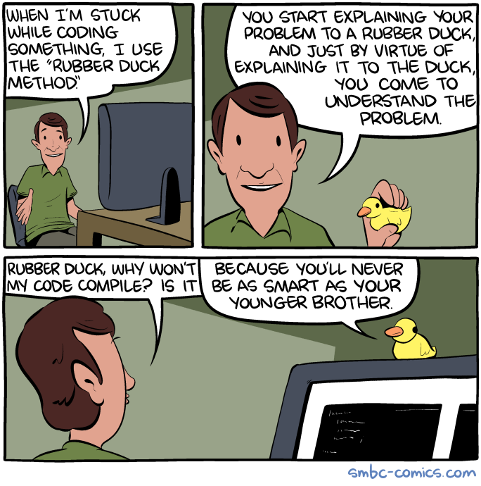
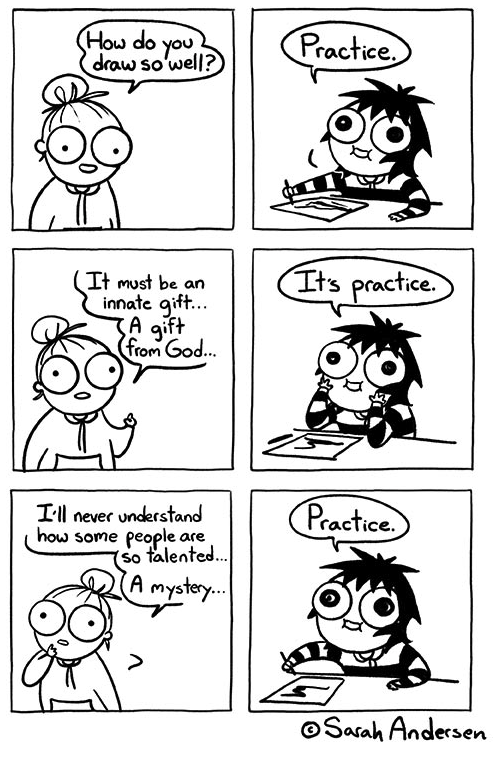
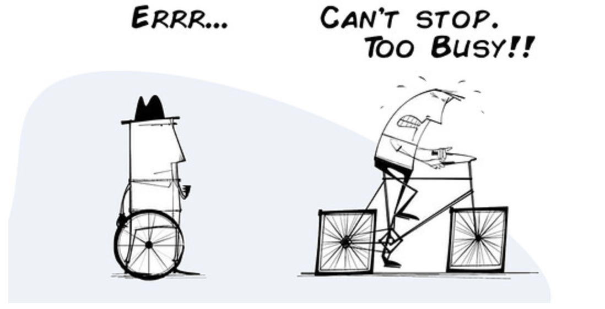

class: big40

## Warm up

-   **Warm up** 📌
-   Setup
-   Clean up
-   Step up
-   Fix up
-   Wrap up

---

## Warm up: Bugs everywhere

-   You'll spend about half of your time fixing bugs or introducing new ones
-   Debbuging : bugs bugs bugs
-   Refactoring : planning for less bugs, introducing new bugs
-   Features : design them, try to break them, solve the bugs
-   R users are not developers

---
class: small20

## Warm up:  Mental game

-   You really really want to believe that the code you wrote is good
-   You don't know when you'll be done, your boss is waiting, your client is paying
-   You feel like an imposter because it "should be easy"
-   You catch yourself just staring at the screen, you're not even thinking anymore
-   Or you're thinking hard, but you don't really know what you're thinking about

.center[

.caption[https://www.xkcd.com/]
]

---

## Warm up:  Mental game

.pull-left[
Confused? 
Distressed?

-   Have a walk
-   Write it down
-   Talk it out
]

.pull-right[.center[

.caption[https://www.smbc-comics.com/]
]]

<!-- You don't need to be as smart as your younger brother, you'll beat him with experience, knowledge, wisdom, mental fortitude. And also, you shouldn't care about being better than your brother -->

---

## Warm up: Art or science ?

A bit of both ?

.pull-left[

]

.pull-right[

]

---

## Warm up: How to get out of trouble?

Don't get in trouble!

.center[

]

-   There are ways to get out of trouble

-   But did you really have to get into trouble ?

---

## Warm up: How not to get into trouble

-   Follow good practice for your own code

-   Depend on good code, don't reinvent the wheel

-   Don't let technical debt accumulate

.center[

]

---

## Warm up:  Technical debt 

-   Cost of taking shortcuts or making compromises
    -   Tight project deadlines,
    -   Lack of resources
    -   Inexperience
    -   Devs just wanna have fun ?
    - ...

Refactoring = investment to reduce technical debt 

(and recover your sanity)

---
