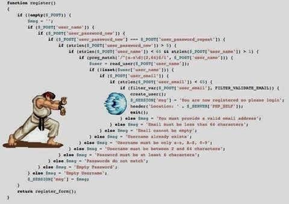

class: big40

```{r, include=FALSE}
knitr::opts_chunk$set(echo = TRUE, eval = FALSE)
```

## Setup

-   Warm up
-   **Setup** 📌
-   Clean up
-   Step up
-   Fix up
-   Wrap up

---

## Setup

* We have a messy code base (maybe not your code)
* We want a clean package to enjoy dedicated tools

... Where do we start ?



---
class: small20

## Setup

A path to refactor a messy codebase into a package.

Real project : order might not be strict, steps might overlap.

- Create a project

- Version control

- Syntactic code

- No absolute paths 

- Create a package

- Declare dependencies

- Extract existing functions

---

## Setup: Create a project

- Create a project 📌

- Version control

- Syntactic code

- No absolute paths 

- Create a package

- Declare dependencies

- Extract existing functions

---

## Setup: Create a project

- No more messy flying scripts on your desktop

```{r}
usethis::create_project()
```

Organization / collaboration / reproducibility...

=> Sets you up for the next steps

---

## Setup: Version control

- Create a project : `usethis::create_project()`

- Version control 📌

- Syntactic code

- No absolute paths 

- Create a package

- Declare dependencies

- Extract existing functions

---

## Setup: Version control

Without version control :

-   Email team about updates
-   Updates directly on production server
-   Previous code is lost, accidental deletions are deadly
-   No trace of who made the changes
-   Versions of code between users might be out of sync
-   Users shy to make any change

---

## Setup:  Version control

With Version control :

-   Version control itself is a communicating tool
-   Work on branches without affecting production code until confident
-   All changes can be reverted
-   All changes and their author can be identified
-   Everyone is synced
-   No harm is irreversible so more confident users

---

## Setup:  Version control

.pull-left[
* Not much knowledge needed to start
* Can be done from RStudio
* Jenny Bryan https://happygitwithr.com

```{r}
usethis::use_git()
```
]

.pull-right[.center[

.caption[http://www.xkcd.com]
]]

---

## Setup: Syntactic code

- Create a project : `usethis::create_project()`

- Version control : `usethis::use_git()`

- Syntactic code 📌

- No absolute paths 

- Create a package

- Declare dependencies

- Extract existing functions

---

## Setup: Syntactic code

-   Codebases often contain non syntactic code
    -   Messy WIP files
    -   Code uncarefully commented
    -   Incorrect copy and paste
    -   ...

`refactor::check_files_parse()` will check all files of the project and make sure R scripts are really Rscripts and that their code is syntactic.

```{r, eval = FALSE, echo = TRUE}
refactor::check_files_parse()
```

---

## Setup: No absolute paths

- Create a project : `usethis::create_project()`

- Version control : `usethis::use_git()`

- Syntactic code : `refactor::check_files_parse()`

- No absolute paths 📌

- Create a package

- Declare dependencies

- Extract existing functions


---

## Setup: No absolute paths

-   Avoiding absolute paths is the norm in software development
-   They force all users to use the same directory layout
-   First reason why your code is not reproducible

If external data stored in file outside of project :
- Path to files should be set in environment variables, options or config files
- Could you have a data package with those ?

---

## Setup: No absolute paths

Relative paths, relative to what ?

-   Relative paths are relative to working directory
    -   By default the project folder in R script if working in project
    -   By default the Rmd file's folder in case of a report
    -   A function might call `setwd()` and alter it and then your scripts don't work anymore
    -   They are often build with `file.path()`

Using `setwd()` sets you up for bad surprises, other scripts can use `setwd()` and disrupt our code, possibly writing the file at the wrong places etc

---

## Setup: No absolute paths

`here::here()` creates a path relative to the project folder, when {here} is loaded it fetches the current working directory (often but not always the project root itself) and finds the project root using heuristics.

-   It guarantees your scripts and Rmds will refer to the same project root
-   Functions that use it won't be polluted by a user or function calling `setwd()`

---

## Setup: No absolute paths

* Use {lintr} to detect and convert absolute paths, and to find problematic
  function calls.
* Use `here::here()` in markdown reports so they have the same wd as your R scripts

```{r, eval = FALSE, echo = TRUE}
## Find absolute paths
lint_dir(linters = absolute_path_linter())

## Find uses of undesirable functions setwd and getwd
lint_dir(linters = undesirable_function_linter(c(setwd = NA, getwd = NA)))

## in a markdown report
here::here("hello", "world.png")
```

---

## Setup: Create a package

- Create a project : `usethis::create_project()`

- Version control : `usethis::use_git()`

- Syntactic code : `refactor::check_files_parse()`

- No absolute paths : `lintr::lint_dir()`

- Create a package 📌

- Declare dependencies

- Extract existing functions


---

## Setup:  Create a package

-   Let's  make our current project a package!

```{r}
usethis::create_package() # locally
usethis::create_package(path) # at chosen location
```

- Move or copy our current project into a "inst/" subfolder.
- Or edit `.Rbuildignore` to ignore some folders
- We have a package! (with no object yet!)
- Hadley Wickham https://r-pkgs.org

---

## Setup: Declare dependencies

- Create a project : `usethis::create_project()`

- Version control : `usethis::use_git()`

- Syntactic code : `refactor::check_files_parse()`

- No absolute paths : `lintr::lint_dir()`

- Create a package : `usethis::create_package()`

- Declare dependencies 📌

- Extract existing functions

---

## Setup: Declare dependencies

-   With scripts we declare dependencies with `library()` calls
-   Or we use the `dplyr::select()` notation and we often don't declare anything at all 

-   For packages we need to add dependencies to the DESCRIPTION file, then we can use the `dplyr::select()` notation
-   If we want to call `select()` without prefix we also need to import it in our package

---

## Setup: Declare dependencies

-   `renv::dependencies()` will analyse your code and attempt to retrieve all dependencies.
-   Then edit the DESCRIPTION file to list those in `Imports`, or use `usethis::use_package("dplyr")`

-   For meta packages like {tidyverse}, mention names separately: ggplot2, tibble, tidyr, readr, purrr, dplyr, stringr, forcats

---

## Setup: Declare dependencies

-   Find all the `library()`/`require()` calls in your project
-   Create a "R/imports.R" script one line per packaged attached with `library()` :

```{r, eval = FALSE, echo = TRUE}
#' @import dplyr
#' @import ggplot2
NULL
```

- Ctrl + Shift + D ( or `devtools::document()`) will populate the NAMESPACE file
- Ctrl + Shift + L ( or `devtools::load_all()`) will attach the imported functions

---
class: small20

## Setup: Declare dependencies

- Create a project : `usethis::create_project()`

- Version control : `usethis::use_git()`

- Syntactic code : `refactor::check_files_parse()`

- No absolute paths : `lintr::lint_dir()`

- Create a package : `usethis::create_package()`

- Declare dependencies : `renv::dependencies()`  
&nbsp; &nbsp; &nbsp; &nbsp; &nbsp; &nbsp; &nbsp; &nbsp; &nbsp; &nbsp;
&nbsp; &nbsp; &nbsp; &nbsp; &nbsp; &nbsp; &nbsp; &nbsp; &nbsp; &nbsp;
&nbsp; &nbsp; &nbsp;`usethis::use_package()`

- Extract existing functions 📌

---

## Setup: Extract existing functions

Function definitions :

-   Are not expensive to source
-   Can be called in any order
-   Can be run before the analysis
-   Might clutter the scripts if they are not isolated
-   Are better ultimately stored in packages
-   Let's move them all to scripts under "R/"

```{r, echo = TRUE, eval = FALSE}
# Find scripts that contain both function definitions and other objects
`refactor::identify_hybrid_scripts()`
```

---
class: small20

## Setup

- Create a project : `usethis::create_project()`

- Version control : `usethis::use_git()`

- Syntactic code : `refactor::check_files_parse()`

- No absolute paths : `lintr::lint_dir()`

- Create a package : `usethis::create_package()`

- Declare dependencies : `renv::dependencies()`  
&nbsp; &nbsp; &nbsp; &nbsp; &nbsp; &nbsp; &nbsp; &nbsp; &nbsp; &nbsp;
&nbsp; &nbsp; &nbsp; &nbsp; &nbsp; &nbsp; &nbsp; &nbsp; &nbsp; &nbsp;
&nbsp; &nbsp; &nbsp;`usethis::use_package()`

- Extract existing functions : `refactor::identify_hybrid_scripts()`

---
