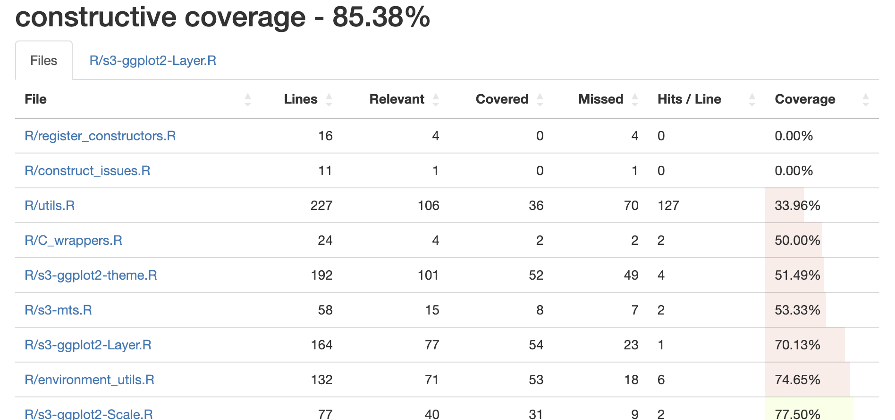
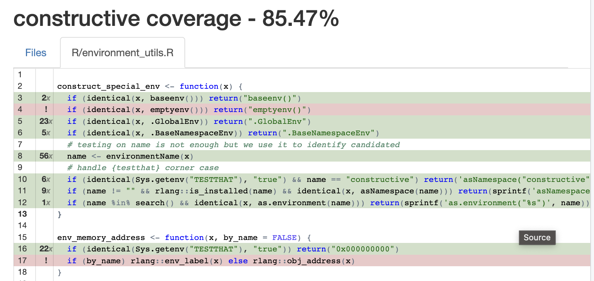

```{r, include=FALSE}
knitr::opts_chunk$set(echo = TRUE, eval = FALSE)
```

## Clean up

-   Warm up
-   Setup
-   **Clean up** 📌
-   Step up
-   Fix up
-   Wrap up

---

## Clean up

* We have a working package
* We didn't lose any information
* We can recover an older situation if we observe unintended behavior
* Now we can tighten things up a bit!

---

## Clean up: Unit tests

- Unit tests 📌

- Extract new functions

- lint and style

- Explicit function imports

- Strive for quiet code

---
class: small20

## Clean up: Unit tests

Unit tests :
  * Ensure that your functions work
  * Ensure that what works keeps working
  
-   {testthat} is a common framework for unit tests
-   Snapshot tests are the easiest, they capture the output of a call and test it against subsequent runs
-   They play very well with version control
-   The priority is to write tests for functions you want to change

.small-code[
```{r, eval = FALSE, echo = TRUE}
usethis::uses_testthat()
usethis::use_test()
expect_snapshot({
  x <- "hello"
  y <- "world"
  my_function(x, y)
})
```
]

---
class: small20 

## Clean up: Unit tests

coverage

-   Coverage is a measure of how much of the code is tested
-   Also makes testing a bit more fun

.small-code[
```{r, eval = FALSE}
covr::report()
```
]



---
class: small20 

## Clean up: Unit tests

coverage

.small-code[
```{r, eval = FALSE}
covr::report()
```
]


---

## Clean up: Extract new functions

- Unit tests 

- Extract new functions 📌

- lint and style

- Explicit function imports

- Strive for quiet code

---

## Clean up: Extract new functions

Scripts are easier to start than functions :

-   No need to think about a function name, no need to isolate arguments and output value
-   We can run them line by line, no need for `browser()` or `debug()`/`debugonce()`

BUT : 

* They're a slippery slope, the garden grows!
* If a script is confusing, it should probably be refactored into one or more functions
* Too many functions : rarely an issue, what about too many scripts ?

---

## Clean up: Extract new functions

* Build functions from scripts and place them in scripts under "R/"
* Hunt source() calls and convert them to good function calls
* Use `refactor::detect_similar_code()` to identify duplicated logic
* Go through these resources :
    -   https://design.tidyverse.org
    -   https://style.tidyverse.org
* Write new unit tests!

---

## Clean up: Extract new functions

-   A good script is self contained, it means
    -   It loads all it needs
    -   It writes its output and stops there, meaning it's not there to populate the global environment with variables for further scripts to pick up

---

## Clean up: Extract new functions

-   A good function works like a sourced script except it has :
    -   It has well defined inputs aka arguments (with optional defaults)
    -   A well defined return value OR a well defined side-effect
    -   A scope
      - less worry about name collision
      
---

## Clean up: Extract new functions

Pure functions:

- A pure function's only effect is to return an output
- This output depends only on its inputs

Side effect functions:

- Output invisibly their main argument or NULL

Avoid hybrid functions!

---

## Clean up: lint and style

- Unit tests 

- Extract new functions

- lint and style 📌

- Explicit function imports

- Strive for quiet code

---

## Clean up: lint and style

- We can use the {lintr} package to improve our code step by step, we might use
  `lintr::lint_package()`
- `styler::style_pkg()` will make your code look good and consistent.
-   `refactor:::use_lintr_template_on_dir()` will open a script where we can go through different linters


```{r, eval = FALSE, echo = TRUE}
refactor:::use_lintr_template_on_dir()
```

---

## Clean up: Explicit function imports

- Unit tests 

- Extract new functions

- lint and style

- Explicit function imports 📌

- Strive for quiet code

---

## Clean up: Explicit function imports

- "' @import dplyr" to "'@importFrom dplyr select"
- "' @import dplyr" to `dplyr::select()`
    -   to avoid conflicts due to new functions
    -   to be notified quickly if a function disappears
    -   to document what features we need from other packages

```{r, eval = FALSE, echo = TRUE}
refactor::find_pkg_funs("dplyr")
```

---

## Clean up: Strive for quiet code

- Unit tests 

- Extract new functions

- lint and style

- Explicit function imports

- Strive for quiet code 📌

---

## Clean up: Strive for quiet code

* Code that talks too much is a sign some things are not robust
* We tend not to read it

- Avoid most warnings as if they were errors
- Avoid messages too when you can
- Give an explicit argument to {dplyr} join functions
- Provide the `col_types` argument to `readr::read_csv`
- Ungroup your data!!! Use `.groups = "drop"` or `.by`
- ...

---

## Clean up: Strive for quiet code

- Unit tests 

- Extract new functions

- lint and style

- Explicit function imports

- Strive for quiet code 📌

---

## Clean up: Extra steps

Not always required 

  * Export functions called directly by the scripts
  * Install your package
  * Move remaining scripts to a different project that calls `library(yourpkg)` 
  * OR Create Rmd report that call `devtools::load_all()` or `library(yourpkg)`
  
---
