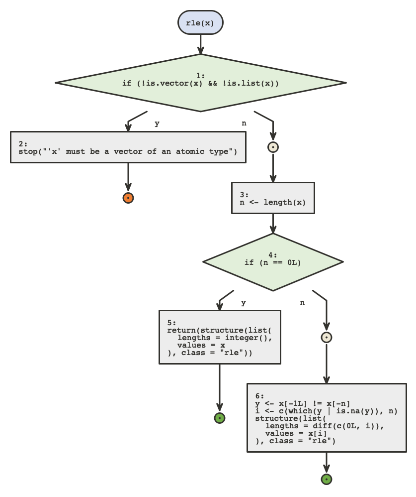
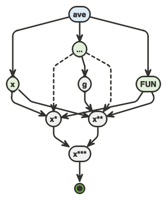
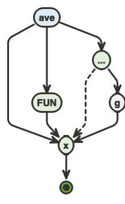
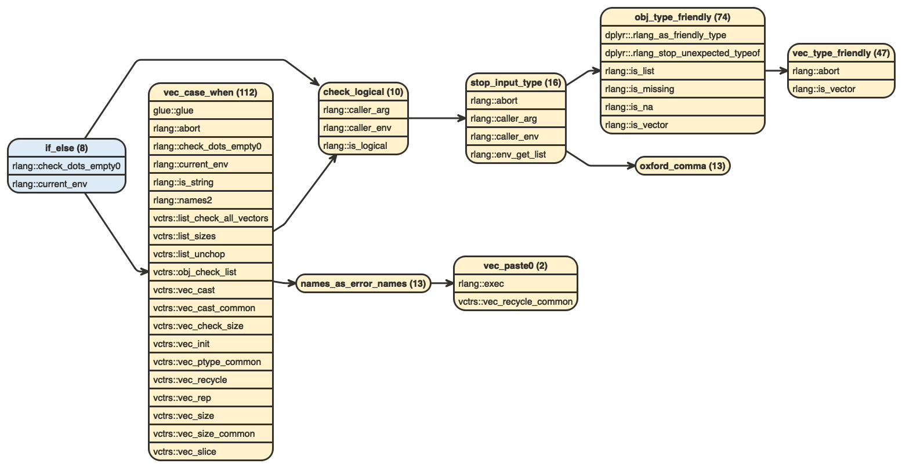
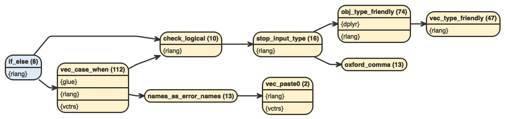
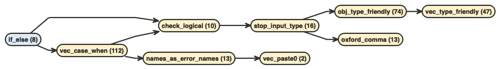
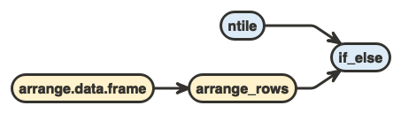
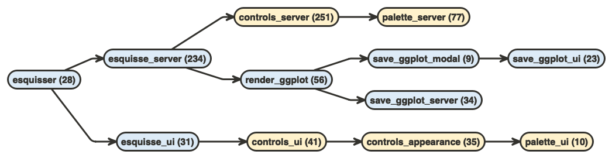

```{r, include=FALSE}
knitr::opts_chunk$set(echo = TRUE, eval = FALSE)
```

## Setup

-   Warm up
-   Setup
-   Clean up
-   **Step up** 📌
-   Fix up
-   Wrap up

---

## Step up

* We have a clean package
* We have a set of steps/principle to apply to improve it and keep it clean

Some additional tools might help

* {refactor}
* {flow}

---
class: big40

## Step up : {refactor}

* {refactor} 📌
* {flow}

---

## Step up : {refactor}

* `remotes::install_github("moodymudskipper/refactor")`
* `%refactor_value%`
* `%refactor_chunk%`

- If functions are well tested we can change them fearlessly
- But how much do you trust your tests ?
- How nice would it be to test your refactoring safely on real cases continuously for some time ?

---
class: small20

## Step up : {refactor}

`%refactor_value%` 

  * Runs each side
  * Fails explicitly when the output is different
  * Often used with functions

.small-code[
```{r, eval = TRUE, echo = TRUE}
library(refactor) # or import in your pkg 
multiply <- function(x, y) {
  purrr::reduce(
    replicate(y, x), 
    .init = x, 
    \(x, y) x + y
  ) - x
}  %refactor_value% {
  x * y
}
```
]

---
class: small20

## Step up : {refactor}

Then we can use it for some time, both sides will be executed and we'll be notified if they give a different output

.small-code[
```{r, eval = TRUE, echo = TRUE, error = TRUE}
multiply(2, 3)
multiply(2, 4.5)
```
]

---
class: small20

## Step up : {refactor}

`%refactor_chunk%` 

  * Runs each side
  * Fails explicitly when the environment changes are different
  * Useful in scripts

.small-code[
```{r, eval = FALSE, echo = TRUE, error = TRUE}
{
  data1 <- dplyr::filter(cars, speed < 5)
  data2 <- dplyr::mutate(data1, speed = speed * 1.60934, speed2 = speed * 1000/3600)
} %refactor_chunk% {
  data1 <- subset(cars, speed < 5)
  data2 <- transform(data1, speed = speed * 1.60934, speed2 = speed * 1000/3600)
}
```
]

---
class: small20

## Step up : {refactor}

.small-code[
```{r, eval = TRUE, echo = TRUE, error = TRUE}
{
  data1 <- dplyr::filter(cars, speed < 5)
  data2 <- dplyr::mutate(data1, speed = speed * 1.60934, speed2 = speed * 1000/3600)
} %refactor_chunk% {
  data1 <- subset(cars, speed < 5)
  data2 <- transform(data1, speed = speed * 1.60934, speed2 = speed * 1000/3600)
}
```
]

---
class: big40

## Step up : {flow}

* {refactor}
* {flow} 📌

---
class: small20

## Step up : {flow}

{flow} helps you visualize:

* The logic of individual functions or scripts
* The dependencies between variables in a given function or script
* The dependencies between functions in a package, or scripts in a folder

```{r}
library(flow)
```

---
class: small20

## Step up : {flow}

Visualize the **logic of individual functions or scripts**

* `flow_view()` can be used on functions or paths

.xsmall-code[
.pull-left[
```{r}
flow_view(rle)
```
.center[

]
]

.pull-right[
```{r, eval = TRUE}
rle
```
]
]

---
class: small20

## Step up : {flow}

* Easier to follow logic for long functions
* A good format to share with colleagues and management
* Lets you identify branches to refactor
* we can use the `out` arg to export or open temp files

```{r}
flow_view(data.frame)
```

---
class: small20

## Step up : {flow}

Visualize the **dependencies between variables** in a given function or script

* `flow_view_vars()` can be used on functions or paths

.xsmall-code[
.pull-left[
```{r}
flow_view_vars(ave)
```
.center[

]
]

.pull-right[
```{r, eval = TRUE}
ave
```
]
]

---
class: small20

## Step up : {flow}

Visualize the **dependencies between variables** in a given function or script

* `flow_view_vars()` can be used on functions or paths

.xsmall-code[
.pull-left[
```{r}
flow_view_vars(ave, expand = FALSE)
```
.center[

]
]

.pull-right[
```{r, eval = TRUE}
ave
```
]
]

---
class: small20

## Step up : {flow}

Visualize the **dependencies between functions** in a package, or scripts in a folder

* `flow_view_deps()` shows the objects called recursively by its input

.small-code[
```{r}
flow_view_deps(dplyr::ifelse)
```
]



---
class: small20

## Step up : {flow}

Visualize the **dependencies between functions** in a package, or scripts in a folder

* `flow_view_deps()` shows the objects called recursively by its input

.small-code[
```{r}
flow_view_deps(dplyr::ifelse, show_imports = "packages")
```
]



---
class: small20

## Step up : {flow}

Visualize the **dependencies between functions** in a package, or scripts in a folder

* `flow_view_deps()` shows the objects called recursively by its input

.small-code[
```{r}
flow_view_deps(dplyr::ifelse, show_imports = "none")
```
]



---
class: small20

## Step up : {flow}

Visualize the **dependencies between functions** in a package, or scripts in a folder

* `flow_view_uses()` shows the functions which call the input directly or indirectly

.small-code[
```{r}
flow_view_uses(dplyr::ifelse)
```
]

.center[

]


---
class: small20

## Step up : {flow}

Visualize the **dependencies between functions** in a package, or scripts in a folder

* `flow_view_shiny()` shows the modular structure of a shiny app

.small-code[
```{r}
flow_view_shiny(esquisse::esquisser, show_imports = "none")
```
]



---

## Step up : {flow}

* {refactor} : continuous live testing
* {flow} : Understand the logic, improve the vision

---
