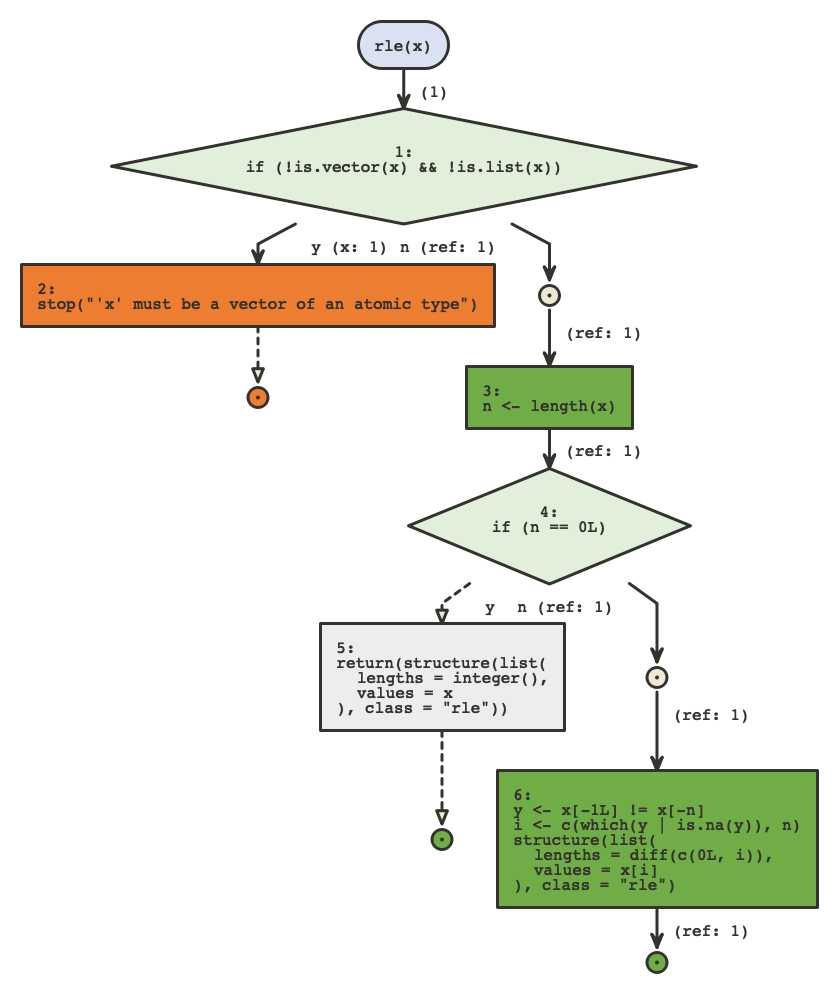
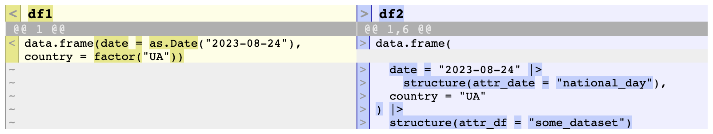

```{r, include=FALSE}
knitr::opts_chunk$set(echo = TRUE, eval = FALSE)
```

## Setup

-   Warm up
-   Setup
-   Clean up
-   Step up*
-    **Fix up ** 📌
-   Wrap up

---

## Fix up : Bugs!

Despite our efforts, trouble found us

.center[

]

---

## Fix up

* What's in a bug ? 📌
* Base R toolkit
* {flow}
* {constructive}
* {boomer}

---
class: small20

## Fix up: What's in a bug ?

A bug is a misunderstanding by the dev or user of either

* The Logic
* The State
* The Data

Where state is made of :
* versions
* OS
* system dependencies
* internet access etc.
* Random seed
* environment stack
* ...

---
## Fix up: What's in a bug ?

* The error message is an attempt to summarize those for you
* The documentation is an attempt to provide you the only knowledge about the
  logic that you need
* You should really read them!
* But it might not be enough

---
class: small20

## Fix up: What's in a bug ?

Minimal reprex: 
  * Minimize the logic: minimal code, minimal dependencies
  * Minimize the state: Run in new session
  * Minimize the data

In those 3 dimensions we can either:
  * start from nothing and add elements until it breaks
  * start from complex case and remove element until it works

---
class: small20

## Fix up: What's in a bug ?

* Use the {reprex} package! 
* Capture those 3 dimensions into something pretty and concise
* You're halfway there
* And likely to get an answer if you ask 
  * http://www.stackoverflow.com
  * RStudio community
  * twitter

---

## Fix up

* What's in a bug ? 
* Base R toolkit 📌
* {flow}
* {constructive}
* {boomer}

---
class: small20

## Fix up: Base R toolkit

Many resources already available, this one is great:
  * Quant Psych: debugging strategy for R
  * https://www.youtube.com/watch?v=9vABzGCQeqU
 
I'll do a quick summary

---
class: small20

## Fix up: Base R toolkit

- `options(warn = 2)` : Fail to better identify situation at time of warning
- `options(error = recover)` : Explore data at different places in the call stack
- `traceback()` : The sequence of calls that got you to an error
- `browser()`, `debug()`, `debugonce()` : Explore the logic step by step from
  a given point, explore the data.
- `typeof()`, `attributes()`, `str()`, `dput()`: often better than `print()`
  to understand objects.
- `message()`, `cat()`: Log information to the console, or to a file, you can use
  `trace()`, `trace(,edit = TRUE)`, `untrace()` to insert logging calls in any function
  temporarily.
- `try()`, `tryCatch()`: Capture error and for instance log or browse if error
- `search()`, `sessionInfo()`, `Sys.info()`: Explore the state
- `on.exit()`: run some code whenever a function is exited, including if error

---

## Fix up: {flow}

* What's in a bug ? 
* Base R toolkit
* {flow} 📌
* {constructive}
* {boomer}

---
class: small20

## Fix up: {flow}

Let's see how `flow_run()` can help us understand a bug better

.small-code[
```{r, echo = TRUE, eval = TRUE}
# this works
df <- data.frame(
  x = "Keep calm and",
  y = "love",
  z = "Ukraine"
)
df
```
]

---
class: small20

## Fix up: {flow}

.small-code[
```{r, echo = TRUE, eval = TRUE}
# this also works
df$y <- emo::ji("heart")
df$z <- emo::ji("ukraine")
df
```
]

---
class: small20

## Fix up: {flow}

.small-code[
```{r, echo = TRUE, error = TRUE, eval = TRUE}
# but this doesn't, why ?
df <- data.frame(
  x = "Keep calm and",
  y = emo::ji("heart"),
  z = emo::ji("ukraine")
)
```
]

---
class: small20

## Fix up: {flow}

Let's explore

.small-code[
```{r, echo = TRUE}
flow_run(data.frame(
  x = "Keep calm and",
  y = emo::ji("heart"),
  z = emo::ji("ukraine")
), out = "png")
```
]

---
class: small20

## Fix up: {flow}

The function `flow_compare_runs()` will compare 2 calls to a same
function.

.small-code[
```{r, echo = TRUE}
flow_compare_runs(rle(NULL), rle(c(1, 2, 2, 3)))
```
]



---

## Fix up: {constructive}

* What's in a bug ? 
* Base R toolkit
* {flow}
* {constructive} 📌
* {boomer}

---
class: small20

## Fix up: {constructive}

* {constructive} strives to represent data simply and accurately.
* Accuracy is crucial when debugging
* We tend to trust `print()` but we shouldn't

.small-code[
```{r, echo = TRUE, eval = TRUE}
df1 <- data.frame(date = as.Date("2023-08-24"), country = factor("UA"))
df2 <- data.frame(date = "2023-08-24", country = "UA")
attr(df2$date, "attr_date") <- "national_day"
attr(df2, "attr_df") <- "some_dataset"
df1
df2
```
]

---
class: small20

## Fix up: {constructive}

`dput()` and `str()` are more accurate here, but hard to read:

.small-code[
```{r, echo = TRUE, eval = TRUE}
dput(df1)

dput(df2)

str(df1)

str(df2)
```
]

---
class: small20

## Fix up: {constructive}

By contrast `constructive::construct()` produces idiomatic code

.small-code[
```{r, echo = TRUE, eval = TRUE}
library(constructive)
construct(df1)

construct(df2)
```
]

---
class: small20

## Fix up: {constructive}

`constructive::construct_diff()` can be used to compare them

.small-code[
```{r, echo = TRUE}
construct_diff(df1, df2)
```
]




---
class: small20

## Fix up: {constructive}

Sometimes dput is inaccurate.

.small-code[
```{r, echo = TRUE, eval = TRUE}
dput(dplyr::select)

construct(dplyr::select)

dput(RSQLite::SQLite())

construct(RSQLite::SQLite())
```
]

---
class: small20

## Fix up: {constructive}

Sometimes it is even non syntactic

.small-code[
```{r, echo = TRUE, eval = TRUE}
dput(environment(dplyr::select))

construct(environment(dplyr::select))
```
]

---
class: small20

## Fix up: {constructive}

Sometimes it is even non syntactic

.small-code[
```{r, echo = TRUE, eval = TRUE}
dt <- data.table::data.table(a=1)
dput(dt)

construct(dt)
```
]

---
class: small20

## Fix up: {constructive}

* We have a lot of control on how we want to generate the code
* This is done by using the `opts_*` functions implemented for supported class

.small-code[
```{r, echo = TRUE, eval = TRUE}
construct(dplyr::band_members)

construct(dplyr::band_members, opts_tbl_df("tribble"))
```
]

---
class: small20

## Fix up: {constructive}

Using the constructor "next" we can opt out of the idiomatic constructor
and use the next method, yet still get a faithful object.

.small-code[
```{r, echo = TRUE, eval = TRUE}
construct(dplyr::band_members, opts_tbl_df("next"))

construct(dplyr::band_members, opts_tbl_df("next"), opts_data.frame("next"))
```
]

---
class: small20

## Fix up: {constructive}

To reproduce a bug `construct_multi()` is handy:

.small-code[
```{r, eval = TRUE}
a <- head(cars, 2)
b <- letters

construct_multi(list(a = a, b = b))
```
]

---

## Fix up: {boomer}

* What's in a bug ? 
* Base R toolkit
* {flow}
* {constructive} 
* {boomer} 📌


---
class: small20

## Fix up: {boomer}

{boomer} makes expressions or functions verbose, so they print the output
of each intermediate step.

`boom()` explodes a call

.small-code[
```{r}
# remotes::install_github("moodymudskipper/boomer")
library(boomer)
boom(1 + !1 * 2)
boom(subset(head(mtcars, 2), qsec > 17))
```
]

---
class: small20

## Fix up: {boomer}

* `rig()` sets up a function so when it's called it prints all intermediate steps
* Use `rig_in_namespace()` to rig permanently a package function during development

.small-code[
```{r}

hello <- function(x) {
  if(!is.character(x) | length(x) != 1) {
    stop("`x` should be a string")
  }
  paste0("Hello ", x, "!")
}

hello2 <- rig(hello)

hello2("world")
```
]

---
class: small20

## Fix up: {boomer}

* `boom()` and `rig()` have a `print` arg to tweak the way values are printed.
* We can use {constructive} there.

Example from SO. A user wanted to understand what this does

.small-code[
```{r}
library(dplyr, warn.conflicts = FALSE)
fun <- function(df, Country_name){
  Country_name <- rlang::parse_expr(quo_name(enquo(Country_name)))
  df %>%
    filter(Country == Country_name)
}
df <- data.frame(x = 1:2, Country = c("Belgium", "Ukraine"))
df
```
]

---
class: small20

## Fix up: {boomer}

.small-code[
```{r}
fun2 <- boomer::rig(fun, print = constructive::construct)
fun2(df, Ukraine)
```
]

---

## Fix up: {boomer}

* What's in a bug ? 
* Base R toolkit
* {flow}
* {constructive} 
* {boomer}

---

## Wrap up

-   Warm up : general ideas
-   Setup : make a messy code base into a proper pakage
-   Clean up : make it better
-   Step up : Useful refactoring tools
-   Fix up : Useful debugging tools
-   **Wrap up** 📌

---

class: center, middle

# Questions?


---

class: center, middle

# Thank you!


